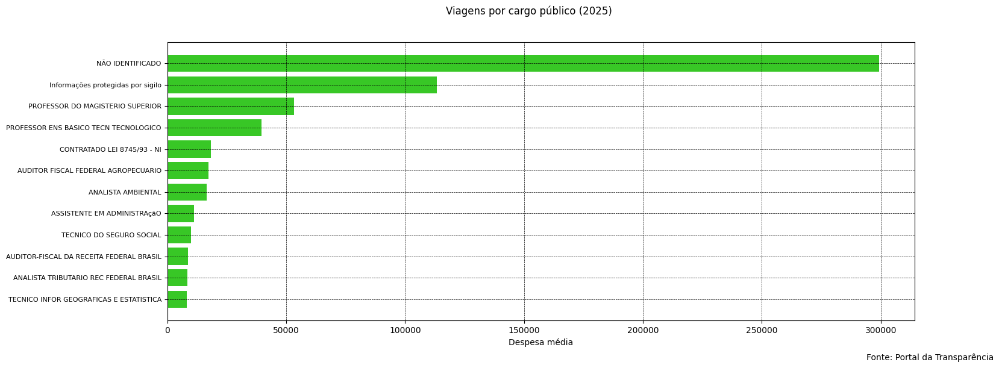

# Análise de Despesas por Cargos Públicos
Este projeto realiza uma análise exploratória de dados (EDA) sobre despesas de viagens associadas a cargos públicos. O foco é identificar padrões de gastos, concentração geográfica e possíveis ineficiências no uso de recursos públicos.

## Objetivo
Identificar comportamentos relevantes na alocação de recursos através da análise de:
* Custo médio e volume total de despesas;
* Frequência de deslocamentos e destinos principais;
* Relação entre a duração das viagens e o custo gerado.

## 📊 Visualização


## 💡 Principais Insights
* **Centralização Administrativa:** Brasília concentra a maior parte das viagens, confirmando uma forte centralização das atividades.
* **Impacto Financeiro:** Existem cargos com alto impacto financeiro devido ao custo médio elevado por viagem, e não apenas pela quantidade de deslocamentos.
* **Possíveis Ineficiências:** Há discrepâncias entre a duração das viagens e o custo total, sugerindo oportunidades de otimização de gastos.
* **Heterogeneidade:** A distribuição de gastos não é homogênea, com grandes variações de custos entre diferentes categorias de cargos.

## 🛠️ Tecnologias Utilizadas
* **Python (Pandas):** Para limpeza, manipulação e tratamento dos dados.
* **Matplotlib:** Para criação das visualizações e storytelling de dados.
* **Jupyter Notebook:** Para desenvolvimento do fluxo de análise.
* **Excel:** Fonte de dados original e suporte para tabelas auxiliares.

## 📜 Certificação Relacionada
Os conhecimentos técnicos aplicados neste projeto foram consolidados através da seguinte certificação:


## 🔍 Análises Realizadas
1. Comparação entre despesa média e total por categoria.
2. Identificação dos cargos com maior impacto no orçamento.
3. Análise de frequência e rotas de destinos.
4. Correlação entre duração da viagem e custo total.

## 💻 Código do Gráfico
Aqui está o trecho de código utilizado para gerar a visualização principal:

```python
import matplotlib.pyplot as plt

# Criando a figura
fig, ax = plt.subplots(figsize=(16, 6))

# Plotando os dados (Quantidade de viagens por Cargo)
ax.barh(df_final['Cargo'], df_final['n_viagens'], color='#38c726')
ax.invert_yaxis()

# Ajustes estéticos
ax.set_facecolor('#ffffff')
fig.suptitle('Quantidade de Viagens por Cargo Público (2025)')
plt.figtext(0.85, 0.00, 'Fonte: Portal da Transparência')
plt.grid(color='black', linestyle="--", linewidth=0.5)
plt.yticks(fontsize=8)
plt.xlabel('Número Total de Viagens')

plt.show()

## Desenvolvido por Maria Eduarda** *Estudante de Ciência da Computação - Focada em Análise de Dados e BI.*
